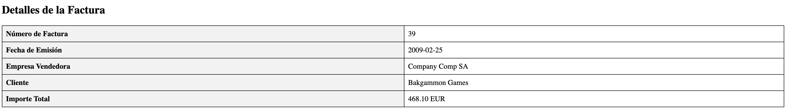
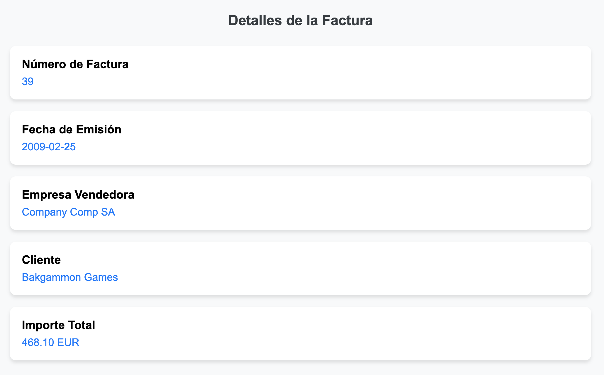

# Transformación de Facturas XML con XSLT

Este proyecto demuestra la transformación de facturas electrónicas en formato FacturaE (XML) a documentos XHTML utilizando XSLT. Se han implementado dos estilos diferentes de visualización: uno en formato tabla tradicional y otro con un diseño moderno de tarjetas.

## Estructura del Proyecto

U30-TareaPaco3-XHTML/
├── factura_ejemplo_31.xml
├── facturae_xslt_table.xslt
├── facturae_xslt_table2.xslt
├── factura1.html
└── factura2.html

## Archivos XML y XSLT

### XML de Entrada

El archivo [factura_ejemplo_31.xml](./factura_ejemplo_31.xml) contiene una factura electrónica en formato FacturaE 3.1. Este documento incluye información como:

- Datos del vendedor y comprador
- Número de factura
- Fecha de emisión
- Importes y totales
- Firma digital

### Primera Transformación (Estilo Tabla)

El archivo [facturae_xslt_table.xslt](./facturae_xslt_table.xslt) transforma el XML en una tabla HTML tradicional:

xslt
<xsl:template match="/">

<html>
<head>
<title>Factura Electrónica</title>

</head>
<!-- ... -->
</html>
</xsl:template>

Resultado:

### Segunda Transformación (Estilo Tarjetas)

El archivo [facturae_xslt_table2.xslt](./facturae_xslt_table2.xslt) genera un diseño moderno usando tarjetas:

xslt
<xsl:template match="/">

<html>
<head>
<title>Factura Electrónica</title>

</head>
<!-- ... -->
</html>
</xsl:template>

Resultado:

## Características Principales

### Estilo Tabla (factura1.html)

- Diseño tabular clásico
- Bordes definidos
- Encabezados sombreados
- Estructura clara y compacta

### Estilo Tarjetas (factura2.html)

- Diseño moderno con tarjetas
- Sombras y bordes redondeados
- Tipografía mejorada
- Espaciado optimizado
- Diseño responsivo
- Colores modernos

## Manejo de Datos XML

Ambas transformaciones manejan los siguientes elementos del XML:
xslt
<xsl:value-of select="//[local-name()='InvoiceNumber']"/>
<xsl:value-of select="//[local-name()='IssueDate']"/>
<xsl:value-of select="//[local-name()='SellerParty']//[local-name()='CorporateName']"/>

También incluyen manejo condicional para diferentes tipos de clientes:
xslt
<xsl:choose>
<xsl:when test="//[local-name()='BuyerParty']//[local-name()='Individual']">

<!-- Manejo de cliente individual -->

</xsl:when>
<xsl:otherwise>

<!-- Manejo de entidad legal -->

</xsl:otherwise>
</xsl:choose>

## Visualización de Resultados

Los archivos HTML resultantes se pueden ver en cualquier navegador web moderno:

- [Ver factura1.html](./factura1.html)
- [Ver factura2.html](./factura2.html)

## Requisitos

- Navegador web moderno
- Procesador XSLT (para transformaciones)
- Editor de texto o IDE (para modificaciones)

## Referencias

- [Tutorial XSLT en MDN](https://developer.mozilla.org/en-US/docs/Web/XML/XSLT/Guides)
- [W3Schools XSLT Reference](https://www.w3schools.com/xml/xsl_elementref.asp)
- [Formato FacturaE](http://www.facturae.gob.es/)
