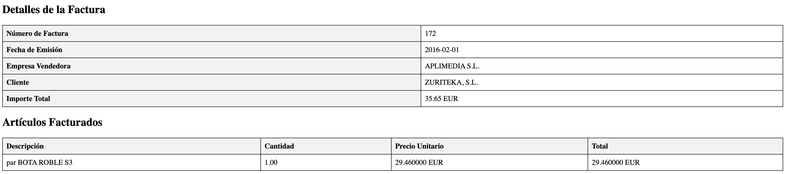

# Transformación de Factura XML a HTML usando XSLT

Este proyecto demuestra la transformación de un archivo XML de factura electrónica a formato HTML utilizando dos estilos XSLT diferentes.

## Estructura del Proyecto

XML2/
├── Ejemplo_Factura.xml
├── facturae1.xslt
├── facturae2.xslt
├── factura1.html
└── factura2.html

## Archivos Fuente

### XML Original

El archivo [Ejemplo_Factura.xml](./Ejemplo_Factura.xml) contiene los datos de una factura electrónica en formato Facturae 3.2.

xml

<?xml version="1.0" encoding="UTF-8"?>

<fe:Facturae xmlns:ds="http://www.w3.org/2000/09/xmldsig#" ...>

<!-- Contenido del XML -->

</fe:Facturae>

## Transformaciones XSLT

### Versión 1 - Estilo Tabla

El archivo [facturae1.xslt](./facturae1.xslt) transforma el XML en una tabla HTML simple:
xslt

<?xml version="1.0" encoding="UTF-8"?>

<xsl:stylesheet version="1.0" xmlns:xsl="http://www.w3.org/1999/XSL/Transform">

<!-- Transformación a tabla HTML -->

</xsl:stylesheet>

### Versión 2 - Estilo Moderno

El archivo [facturae2.xslt](./facturae2.xslt) crea una versión más moderna usando cards y efectos CSS:

xslt

<?xml version="1.0" encoding="UTF-8"?>

<xsl:stylesheet version="1.0" xmlns:xsl="http://www.w3.org/1999/XSL/Transform">

<!-- Transformación a diseño moderno -->

</xsl:stylesheet>

## Resultados HTML

### Versión 1 - Tabla Simple

El archivo [factura1.html](./factura1.html) muestra una presentación tradicional en forma de tabla:

### Versión 2 - Diseño Moderno

El archivo [factura2.html](./factura2.html) presenta un diseño moderno con tarjetas y efectos visuales:

## Características Principales

### Versión 1 (Tabla)

- Diseño tabular clásico
- Estilo minimalista
- Fácil de imprimir
- Separación clara de datos

### Versión 2 (Moderna)

- Diseño con tarjetas (cards)
- Efectos de hover
- Gradientes de color
- Diseño responsivo
- Efectos de sombra y elevación
- Tipografía moderna

## Uso

Para transformar el XML usando cualquiera de los estilos XSLT, puede usarse un procesador XSLT como `xsltproc`:

bash
xsltproc facturae1.xslt Ejemplo_Factura.xml > factura1.html
xsltproc facturae2.xslt Ejemplo_Factura.xml > factura2.html

## Notas Técnicas

- Las transformaciones mantienen toda la información relevante del XML original
- Ambos estilos son completamente responsivos
- La versión 2 incluye mejoras visuales significativas sin sacrificar la legibilidad
- Se han utilizado técnicas modernas de CSS como flexbox y gradientes

## Requisitos

- Navegador web moderno para visualizar los efectos CSS
- Procesador XSLT para realizar las transformaciones
